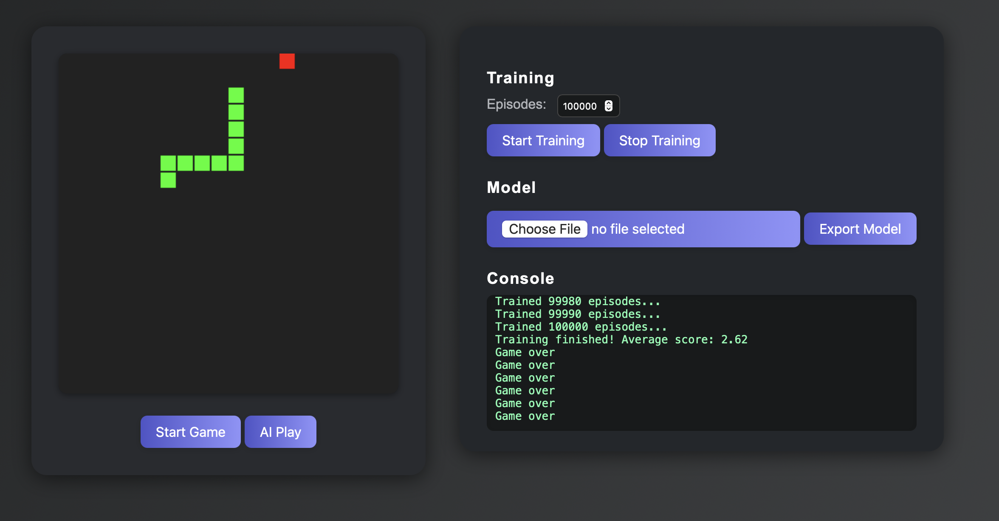

# Snake AI Web

A modern, interactive Snake game with AI that learns to play using Q-learning — all in your browser!



## Features

- Play classic Snake manually or let the AI play for you
- Train the AI in your browser using Q-learning (CPU only, no server needed)
- Save and load AI models (Q-table) as JSON files
- Beautiful, responsive UI with live console logs
- 100% pure HTML + JavaScript, no dependencies

## Getting Started

1. **Clone or download this repository**
2. Open `index.html` in your browser (no build or server required)

## How to Use

### Play Snake
- Click **Start Game** to play manually (use arrow keys)
- Click **AI Play** to let the AI control the snake using the current model

### Train the AI
- Set the number of episodes in the **Episodes** box
- Click **Start Training** to begin Q-learning
- Watch the console for progress and average score
- Click **Stop Training** to interrupt

### Model Management
- **Export Model**: Download the current Q-table as a JSON file
- **Load Model**: Upload a previously saved Q-table to continue training or use for AI play

## How it Works

- Uses a simple Q-learning algorithm with a discrete state (relative food position + direction)
- All training and inference run in the browser (no backend, no Python)
- Model is a plain JavaScript object (Q-table), easily exportable/importable

## File Structure

```
web/
  index.html         # Main HTML file
  snake_ai_web.js    # Game, AI, and UI logic (pure JS)
  README.md          # This file
```

## License

This project is licensed under the MIT License. See the [LICENSE](LICENSE) file for details.
